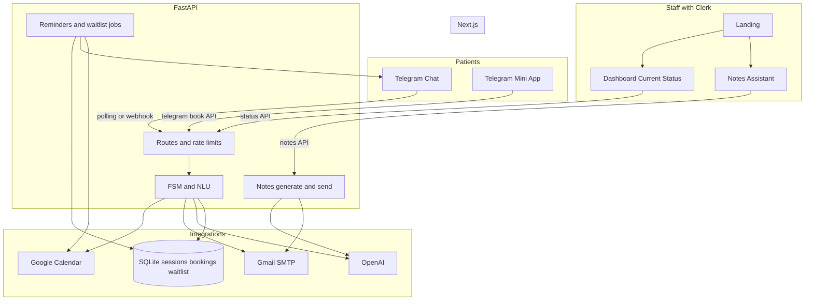
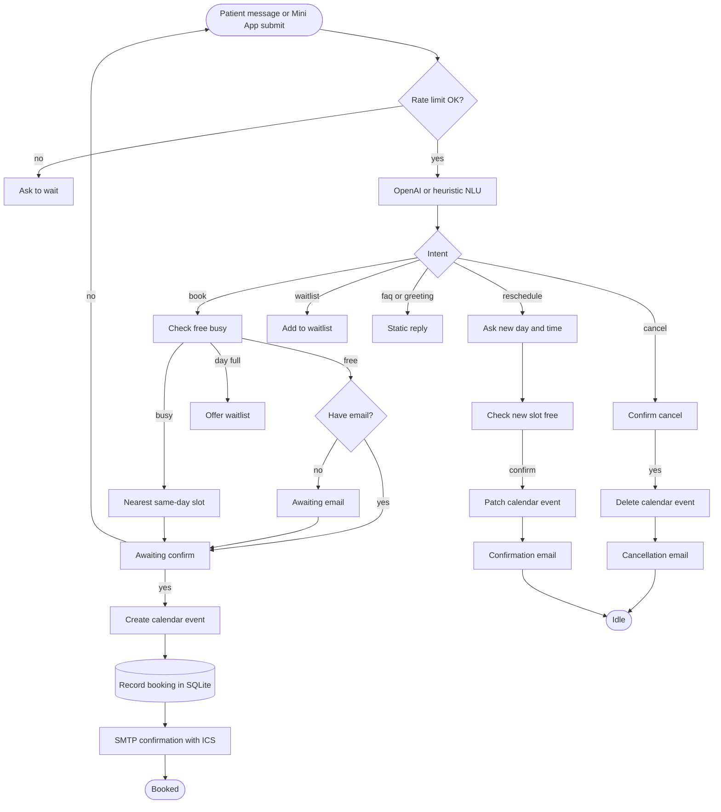
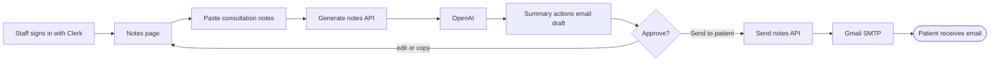
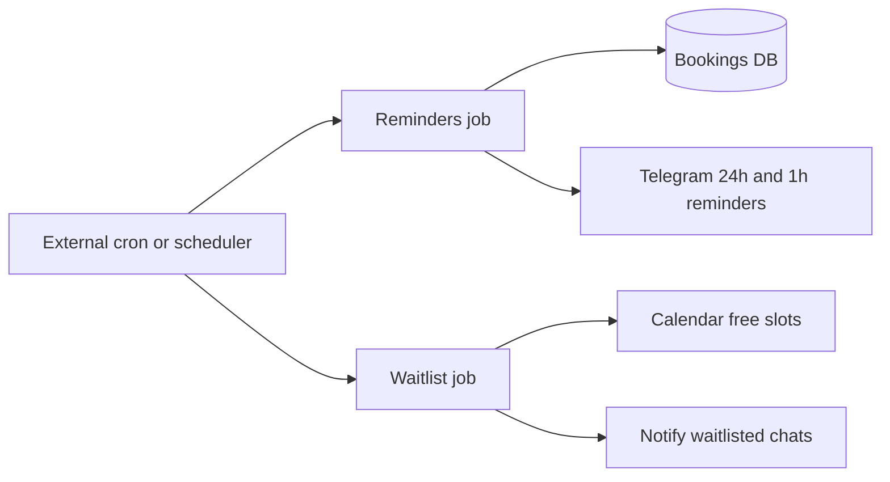

# BrightCare Clinic

Telegram appointment booking and staff tools for **BrightCare Clinic**: live Google Calendar availability, OpenAI NLU, Gmail confirmations, a Telegram Mini App, Clerk-protected dashboard, and a consultation-notes assistant with one-click patient email send.

## Features

### Patient booking (Telegram)
- Multi-turn **FSM** with OpenAI intent extraction (heuristic fallback when no API key)
- **Book**, **cancel**, and **reschedule** flows with calendar delete/patch
- Same-day nearest-slot suggestions when the requested time is busy
- **Waitlist** when a day is full (`notify me`)
- Per-chat rate limiting and booking locks against double-confirm
- Gmail confirmation emails with **`.ics`** attachments

### Telegram Mini App (`/telegram`)
- Live **slot grid** from `GET /api/telegram/slots`
- Day/time/email picker with Telegram `MainButton`
- **My appointments** history per `chat_id`
- Requires HTTPS in Telegram — set `TELEGRAM_WEBAPP_URL` (ngrok locally or Vercel in prod)

### Staff web (Clerk)
- **Landing** — bright teal branding aligned with [brightcareclinic.com](https://www.brightcareclinic.com/)
- **Current Status** (`/dashboard`) — integration health probes, FSM pipeline, sessions, recent bookings
- **Consultation notes** (`/notes`) — paste visit notes → professional summary, action items, patient email draft → **Send to patient** via SMTP

### Persistence & ops
- **SQLite** session store and booking history (`DATA_DIR`, default `data/`)
- Real health probes: Telegram `getMe`, Calendar, SMTP login, OpenAI
- Cron endpoints: `POST /api/jobs/reminders` (24h / 1h), `POST /api/jobs/waitlist` (optional `JOBS_SECRET`)
- **GitHub Actions** CI: pytest + `npm run build`

## Architecture

### System overview



### Patient booking flow



### Staff notes flow



### Background jobs



## Design notes

- **OpenAI** extracts intent/slots as JSON; the **FSM** owns multi-turn state (`yes` → previously proposed slot).
- **`CLINIC_TIMEZONE`** (default `Asia/Singapore`) drives hours, slot parsing, free/busy bounds, and calendar `timeZone`.
- **Google Calendar** via service account — calendar must be **shared** with the SA email (Make changes to events).
- **Telegram**: `polling` locally; `webhook` when deployed (`PUBLIC_BASE_URL`).
- **Clerk** guards staff routes only. Patients book via Telegram `chat_id` — no Clerk login required.

## Business rules

- Hours: Mon–Fri 09:00–18:00 clinic-local; 30-minute slots; last start 17:30.
- If requested time is busy: soonest free slot **≥ requested, same day**; if none, offer waitlist or another day.
- Re-check free/busy before create; per-chat lock against duplicate bookings.

## Repo layout

```
api/
  agent/           FSM, NLU, sessions, bookings, rate limits
  integrations/    Calendar, email, Telegram, health probes
  jobs/            Reminders + waitlist cron handlers
  notes.py         Consultation summary / email generation
app/
  page.tsx         Landing
  dashboard/       Current Status
  notes/           Staff notes assistant
  telegram/        Mini App
tests/             pytest (FSM, calendar, roadmap, notes)
.github/workflows/ CI
Dockerfile         API image for webhook deploy
.env.example
```

## Setup

### 1. Telegram

1. [@BotFather](https://t.me/BotFather) → `/newbot` → `TELEGRAM_BOT_TOKEN`.
2. Set `TELEGRAM_BOT_USERNAME` and `NEXT_PUBLIC_TELEGRAM_BOT_USERNAME`.

**Mini App (HTTPS required in Telegram):**

```env
TELEGRAM_WEBAPP_URL=https://your-app.vercel.app/telegram
NEXT_PUBLIC_TELEGRAM_WEBAPP_URL=https://your-app.vercel.app/telegram
```

Restart the API — it calls `setChatMenuButton`. Send `/start` in the bot for **Book appointment**.

### 2. Google Calendar

1. Enable **Calendar API** in Google Cloud.
2. Create a **service account** → download JSON → `credentials.json` (gitignored) → `GOOGLE_SERVICE_ACCOUNT_FILE=credentials.json`.
3. Share your calendar with the service account email (**Make changes to events**).
4. Set `GOOGLE_CALENDAR_ID` (often your Gmail for a primary calendar).
5. Restart the API after sharing — otherwise inserts return `404 Not Found`.

### 3. OpenAI

`OPENAI_API_KEY` — used for booking NLU and consultation-notes generation. Tests run without it (heuristics).

### 4. Gmail SMTP

1. Enable **2-Step Verification** on the Gmail account.
2. Create an **App Password** (16 characters) → `SMTP_APP_PASSWORD`.
3. Set `SMTP_USER` and `SMTP_FROM` to that Gmail address.

> Normal Gmail passwords fail with `Application-specific password required`.

Used for: appointment confirmations (`.ics`), cancellation notices, and staff **Send to patient** from `/notes`.

### 5. Clerk

`NEXT_PUBLIC_CLERK_PUBLISHABLE_KEY`, `CLERK_SECRET_KEY`, `CLERK_JWKS_URL` — protects `/dashboard` and `/notes`.

### 6. Install

```bash
cp .env.example .env.local
# fill secrets

npm install
conda run -n torch_env python -m pip install -r requirements.txt
```

## Run locally

### A. Chat bot + website (no HTTPS needed)

Terminal A — API + Telegram polling:

```powershell
$env:PYTHONNOUSERSITE=1
C:\Users\Padmanabh\.conda\envs\torch_env\python.exe -m uvicorn api.index:app --host 127.0.0.1 --port 8000
```

Terminal B — Next.js:

```powershell
npm run dev
```

| URL | Purpose |
|-----|---------|
| http://localhost:3000 | Landing |
| http://localhost:3000/dashboard | Current Status (Clerk) |
| http://localhost:3000/notes | Consultation notes (Clerk) |
| http://localhost:3000/telegram | Mini App (browser test) |
| http://localhost:8000/health | API health |

Chat booking works immediately with polling. On `/telegram` in a browser, use **Chat ID (dev only)** if Telegram did not inject a user id.

### B. Mini App inside Telegram (ngrok)

1. [ngrok](https://ngrok.com/download) → `ngrok http 3000`
2. Add to `.env.local`:
   ```env
   TELEGRAM_WEBAPP_URL=https://YOUR-NGROK-HOST/telegram
   NEXT_PUBLIC_TELEGRAM_WEBAPP_URL=https://YOUR-NGROK-HOST/telegram
   ```
3. Restart the API → `/start` in Telegram → **Book appointment**.

## API reference (selected)

| Method | Path | Auth | Description |
|--------|------|------|-------------|
| GET | `/health` | — | Service health |
| GET | `/api/status` | Clerk | Dashboard payload + integration probes |
| GET | `/api/telegram/slots?weekday=monday` | — | Available 30-min starts |
| GET | `/api/telegram/appointments?chat_id=` | — | Masked booking history |
| POST | `/api/telegram/book` | — | Mini App book / confirm |
| POST | `/api/notes/generate` | Clerk | Summary + actions + email draft |
| POST | `/api/notes/send` | Clerk | Send approved patient email |
| POST | `/api/dev/chat` | — | Local FSM test `{"chat_id","text"}` |
| POST | `/api/jobs/reminders` | `X-Jobs-Secret` | 24h / 1h Telegram reminders |
| POST | `/api/jobs/waitlist` | `X-Jobs-Secret` | Notify waitlisted patients |

## Tests

```bash
conda run -n torch_env pytest -q
```

CI runs the same on push/PR (`.github/workflows/ci.yml`).

## Deploy

### Frontend (Vercel) — already live

Site: https://bright-care-five.vercel.app/

Set on Vercel (Production, then Redeploy):

| Variable | Value |
|----------|--------|
| `API_PROXY_URL` | `https://YOUR-API.onrender.com` (no trailing slash) |
| `NEXT_PUBLIC_TELEGRAM_BOT_USERNAME` | `BrightCare_bot` |
| `NEXT_PUBLIC_TELEGRAM_WEBAPP_URL` | `https://bright-care-five.vercel.app/telegram` |
| Clerk keys | same as local |

### API on Render (recommended)

Blueprint: [`render.yaml`](render.yaml).

1. [Render](https://render.com/) → **New** → **Blueprint** → connect `padmanabh275/BrightCare`.
2. Fill secrets (`sync: false` in the blueprint):

| Secret | Notes |
|--------|--------|
| `TELEGRAM_BOT_TOKEN` | from BotFather |
| `TELEGRAM_BOT_USERNAME` | `BrightCare_bot` |
| `PUBLIC_BASE_URL` | your Render URL after first deploy, e.g. `https://brightcare-api.onrender.com` |
| `OPENAI_API_KEY` | |
| `GOOGLE_CALENDAR_ID` | clinic calendar id |
| `GOOGLE_SERVICE_ACCOUNT_JSON` | full JSON from `credentials.json` (or base64) |
| `SMTP_USER` / `SMTP_APP_PASSWORD` / `SMTP_FROM` | Gmail app password |
| `CLERK_JWKS_URL` | for `/api/status` and notes |

3. After first deploy, set `PUBLIC_BASE_URL` to the live service URL → Manual Deploy.
4. Check `https://YOUR-API.onrender.com/health`.
5. Vercel: `API_PROXY_URL=https://YOUR-API.onrender.com` → Redeploy.
6. Stop local uvicorn (or set local `TELEGRAM_MODE=polling` only when not using Render) so only one bot receiver is active.
7. Telegram `/start` → Open booking app (Vercel UI → Render API).

SQLite persists on the Render disk at `/data`.

### API on Railway (alternative)

1. [Railway](https://railway.app/) → New Project → Deploy GitHub `BrightCare`.
2. Uses [`Dockerfile`](Dockerfile) + [`railway.toml`](railway.toml).
3. Add a volume at `/data`.
4. Same env vars as Render (`TELEGRAM_MODE=webhook`, `PUBLIC_BASE_URL`, `GOOGLE_SERVICE_ACCOUNT_JSON`, …).
5. Point Vercel `API_PROXY_URL` at the Railway HTTPS URL.

### Google credentials on the cloud

Do not commit `credentials.json`. Paste into:

```env
GOOGLE_SERVICE_ACCOUNT_JSON={"type":"service_account",...}
```

The API writes it to `$DATA_DIR/credentials.json` on boot.

### Docker smoke test

```bash
docker build -t brightcare-api .
docker run -p 8000:8000 \
  -e TELEGRAM_MODE=polling \
  -e GOOGLE_SERVICE_ACCOUNT_JSON="$(cat credentials.json)" \
  -e GOOGLE_CALENDAR_ID=... \
  -e OPENAI_API_KEY=... \
  brightcare-api
```

### Back to local polling

```env
TELEGRAM_MODE=polling
```

Restart local uvicorn — it calls `deleteWebhook`. Pause the Render service if both would fight over Telegram.

### Cron jobs (optional)

```
POST https://YOUR-API.onrender.com/api/jobs/reminders
Header: X-Jobs-Secret: <JOBS_SECRET>
```

Same path for `/api/jobs/waitlist`.

## Demo script

1. **Book:** Telegram → “Can I book Monday at 2pm?” → confirm → calendar event + email.
2. **Cancel:** “cancel my appointment” → yes → event removed + cancellation email.
3. **Reschedule:** “reschedule my appointment” → new time → confirm.
4. **Mini App:** Open `/telegram` → pick slot from grid → confirm.
5. **Dashboard:** Sign in → Current Status → integration chips + recent bookings.
6. **Notes:** Sign in → `/notes` → paste consultation notes → Generate → **Send to patient**.
7. **FAQ:** “Where are you located?” / parking / walk-ins.

## Environment variables

See `.env.example`. Key additions beyond the core take-home:

| Variable | Default | Purpose |
|----------|---------|---------|
| `SESSION_STORE` | `sqlite` | `sqlite` or `memory` (tests use memory) |
| `DATA_DIR` | `data` | SQLite DBs for sessions + bookings |
| `JOBS_SECRET` | — | Protects cron job endpoints |
| `TELEGRAM_WEBAPP_URL` | — | HTTPS Mini App URL for bot menu |
| `GOOGLE_SERVICE_ACCOUNT_JSON` | — | Cloud: paste credentials JSON (or base64) |
| `API_PROXY_URL` | localhost | Vercel → public FastAPI origin |

## Assumptions

- Patients speak in **clinic local time**.
- Without Google credentials the API uses an **in-memory calendar** (dev/tests only).
- Use **real patient emails** for SMTP tests — placeholders like `patient@example.com` bounce.
- Notes output is **draft-only** until staff review and click Send.

## With more time

Multi-practitioner calendars, Clerk↔Telegram account linking, Redis for multi-instance sessions, staff block-slot UI on the dashboard.
